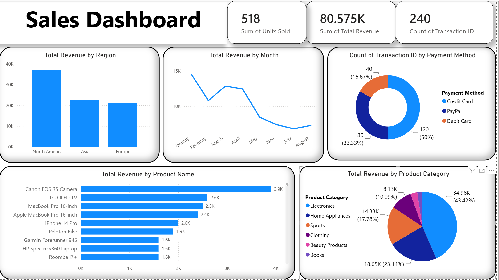

# Sales Dashboard – Regional Performance Overview

An interactive Power BI dashboard analyzing sales performance across multiple regions, product categories, and payment methods.



## 📊 Overview

This dashboard provides a single-page view of sales performance, including:

- **Revenue by Region** — column chart comparing total revenue across regions
- **Revenue Trend Over Time** — line chart with drill-down by year, quarter, month, and day
- **Revenue by Product Category** — pie chart showing category-level contribution
- **Revenue by Product Name** — bar chart ranking individual products
- **Sales by Payment Method** — donut chart of transaction share by payment type
- **KPI Cards** — Total Revenue, Units Sold, and Transaction Count

## 🗂️ Data

The report is built on a single table containing the following fields:

| Field | Description |
|---|---|
| Region | Geographic sales region |
| Product Category | High-level product grouping |
| Product Name | Individual product |
| Payment Method | How the transaction was paid |
| Total Revenue | Revenue generated per transaction |
| Units Sold | Quantity sold per transaction |
| Transaction ID | Unique transaction identifier |
| Date | Transaction date |

## 🛠️ Tools Used

- Power BI Desktop

## 🚀 How to Use

1. Clone or download this repository.
2. Open `1st_dashboard.pbix` in Power BI Desktop.
3. Explore the interactive visuals — click on any chart to cross-filter the others.

## 📌 Key Insights

- Insight 1: North America has the highest revenue.
- Insight 2: The Electronics category generated the most revenue.
- Insight 3: Revenue peaked in January, the highest of any month.

## 📁 Project Structure

```
├── Sales Dashboard.pbix                                 # Power BI report file
├── screenshot.png                                      # Dashboard preview image
└── README.md                                            # Project documentation
└── Comparing Sales Data Across Multiple Regions.csv      # Data set file
```
